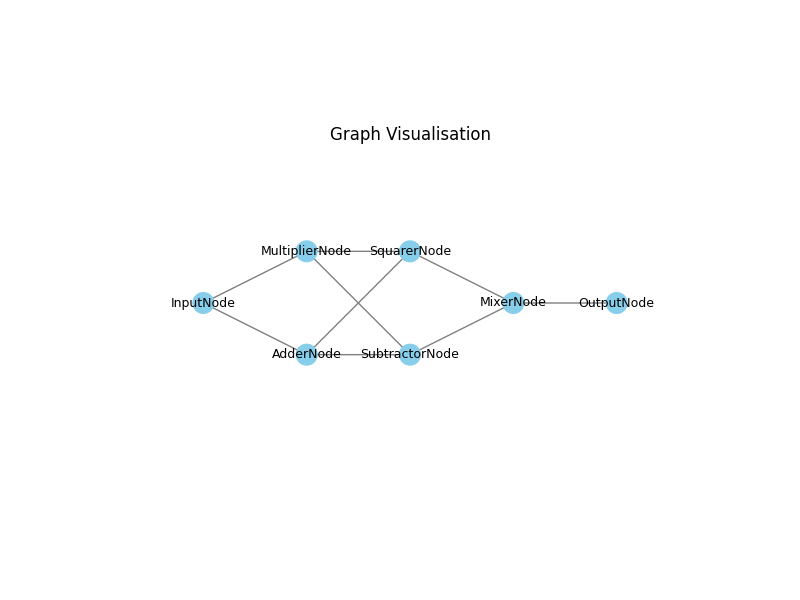

# Graph Processing Pipeline

A modular and extensible graph-based processing pipeline for data transformations.

## Features

- **Pipeline Processing:** Chain functions together using a `Pipe` for seamless data transformation.
- **Graph Representation:** Nodes and layers allow structured data flow.
- **Logging & Error Handling:** Integrated logging for debugging.
- **Visualization:** Display the graph structure using `matplotlib`.

## Installation

Clone the repository:
```sh
$ git clone https://github.com/CoKn/graph-pipeline.git
$ cd graph-pipeline
```

Install dependencies:
```sh
$ pip install -r requirements.txt
```

## Usage

### Importing the Module
```python
from Graph.graph import Pipe, DataNode, ProcessingNode, Layer, Graph, MixerNode
```

### Define Processing Functions
```python
def add_value(value=1, **data):
    data["passthrough"] = data.get("passthrough", 0) + value
    return data

def multiply_value(**data):
    data["passthrough"] = data.get("passthrough", 1) * data.get("m", 1)
    return data

def subtract_value(value=3, **data):
    data["passthrough"] = data.get("passthrough", 0) - value
    return data

def square_value(**data):
    val = data.get("passthrough", 0)
    data["passthrough"] = val * val
    return data
```

### Building the Graph
```python
# Create input node
input_node = DataNode(name="InputNode", data={"passthrough": 10})
input_layer = Layer(nodes=[input_node])

# Create processing nodes with pipelines
adder_node = ProcessingNode(name="AdderNode")
multiplier_node = ProcessingNode(name="MultiplierNode")
adder_pipeline = Pipe() | (lambda **data: add_value(value=5, **data))
multiplier_pipeline = Pipe(value={"m": 3}) | multiply_value
adder_node.set_pipeline(adder_pipeline)
multiplier_node.set_pipeline(multiplier_pipeline)
processing_layer1 = Layer(nodes=[adder_node, multiplier_node])
input_layer.connect_to(processing_layer1)

# Create further processing nodes
subtractor_node = ProcessingNode(name="SubtractorNode")
squarer_node = ProcessingNode(name="SquarerNode")
subtractor_pipeline = Pipe() | (lambda **data: subtract_value(value=3, **data))
squarer_pipeline = Pipe() | square_value
subtractor_node.set_pipeline(subtractor_pipeline)
squarer_node.set_pipeline(squarer_pipeline)
processing_layer2 = Layer(nodes=[subtractor_node, squarer_node])
processing_layer1.connect_to(processing_layer2)

# Create mixer and output nodes
mixer_node = MixerNode(name="MixerNode")
mixer_layer = Layer(nodes=[mixer_node])
processing_layer2.connect_to(mixer_layer)
output_node = DataNode(name="OutputNode")
output_layer = Layer(nodes=[output_node])
mixer_layer.connect_to(output_layer)

# Process the pipeline
input_layer.process()

# Visualize the graph
graph = Graph(layers=[input_layer, processing_layer1, processing_layer2, mixer_layer, output_layer])
graph.visualise()
```



## Logging
The pipeline includes logging for debugging. Example output:
```
2025-03-06 12:34:56 - INFO - InputNode processing data: {'passthrough': 10}
2025-03-06 12:34:57 - INFO - AdderNode processed data: {'passthrough': 15}
2025-03-06 12:34:58 - INFO - MultiplierNode processed data: {'passthrough': 45}
...
```

## Contributing
Feel free to submit issues and pull requests to improve this project!

## License
This project is licensed under the MIT License.
